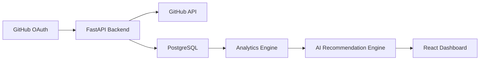
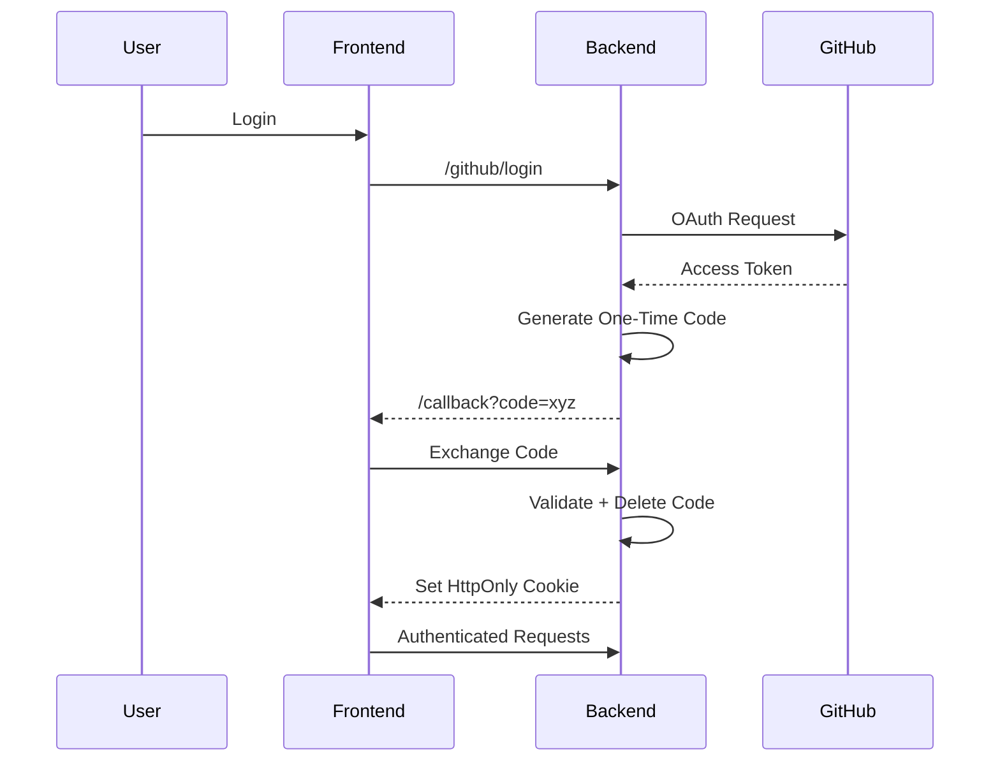
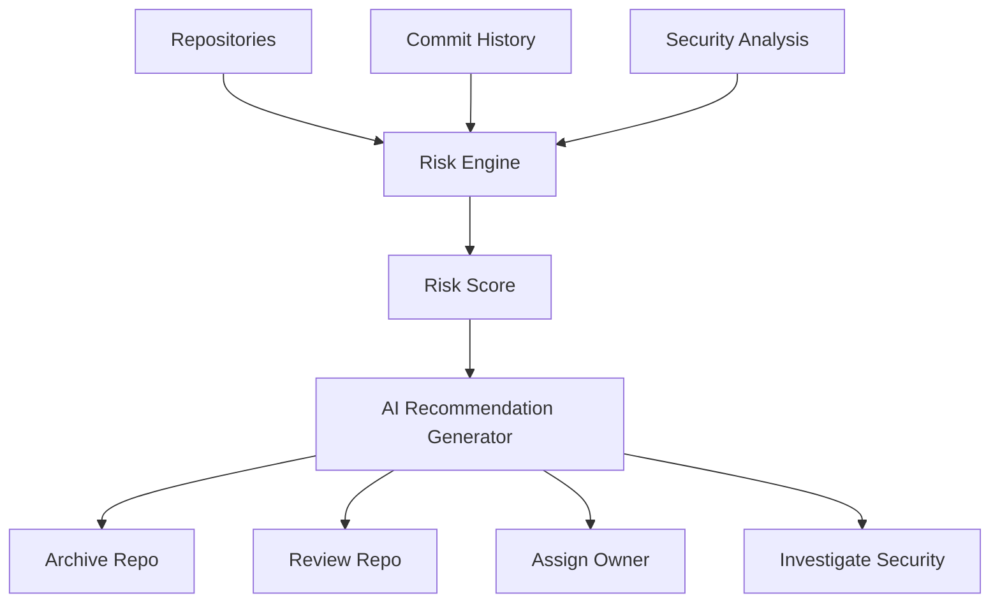
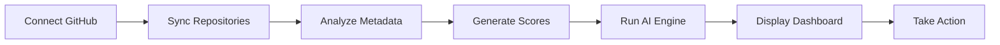

# 🚀 SaaS Ops Copilot


<p align="center">


</p>

<p align="center">
AI-powered GitHub Repository Intelligence Platform
</p>

<p align="center">
Detect dormant repositories, estimate CI/CD waste, surface security risks, and generate AI-powered remediation plans in seconds.
</p>

---

#  Demo
<Opening Page


> Dashboard


>Risk Scores


> Security


> AI Insights


> Cost Waste


> Repo Health


> AI Copilot


---

# ⚡ Problem

Engineering organizations accumulate:

* Abandoned repositories
* Forgotten experiments
* Public repositories with stale code
* Unused CI/CD pipelines
* Unknown maintenance ownership

These create:

🔴 Security exposure

🔴 Infrastructure waste

🔴 Compliance risks

🔴 Operational blind spots

---

# 💡 Solution

SaaS Ops Copilot automatically analyzes GitHub repositories and generates actionable operational intelligence.

### Features

✅ Dormant Repository Detection

✅ Repository Risk Scoring

✅ Security Findings

✅ Cost Waste Analysis

✅ AI Recommendations

✅ Natural Language Copilot

✅ Action Center (Jira / Slack / Email)

---

# 🏗️ System Architecture



---

# 🔐 Secure OAuth Architecture



---

# 🤖 AI Recommendation Pipeline



---

# 📊 Dashboard Overview

## Repository Health

| Metric            | Description             |
| ----------------- | ----------------------- |
| Risk Score        | 0-100 severity          |
| Dormancy          | Days inactive           |
| Security Findings | Critical issues         |
| Cost Waste        | Estimated monthly spend |
| Recommendations   | AI-generated actions    |

---

# 🎯 User Workflow



---

# 📈 Business Impact

Example analysis:

| Metric                      | Value  |
| --------------------------- | ------ |
| Repositories Scanned        | 128    |
| Dormant Repositories        | 42     |
| Public Dormant Repositories | 9      |
| Monthly Waste               | $1,150 |
| Critical Findings           | 6      |

Potential yearly savings:

# 💰 $13,800+

---

# 🧠 AI Copilot

Ask natural language questions:

```text
Which repository is most at risk?

How much CI/CD spend is wasted?

Show top 3 actions I should take.

Which public repositories are inactive?
```

---

# ⚙️ Tech Stack

## Frontend

* React 19
* TypeScript
* Vite
* React Router
* Recharts

## Backend

* FastAPI
* Python 3.12
* SQLAlchemy
* PostgreSQL
* Authlib

## Security

* GitHub OAuth
* One-Time Code Exchange
* HttpOnly Cookies
* Secure Sessions

---

# 📂 Project Structure

```text
ai-saas-copilot

backend/
├── api/
├── agents/
├── services/
├── db/
├── models/

frontend/
├── pages/
├── services/
├── components/
├── assets/
```

---

# 🚀 Future Roadmap

### Phase 1

* Redis Token Storage
* Scheduled Sync Jobs
* Organization Selector

### Phase 2

* Slack Integration
* Jira Integration
* Email Notifications

### Phase 3

* Multi-Agent Analysis
* Repository Ownership Detection
* Compliance Monitoring

### Phase 4

* Autonomous AI Operations Agent

---

# ⭐ Why This Project Stands Out

Unlike traditional repository dashboards, SaaS Ops Copilot focuses on:

* Operational Intelligence
* Security Exposure Detection
* Cost Optimization
* AI-Powered Recommendations

Turning GitHub from a source-code platform into an operational decision engine.

---

# 📜 License

MIT
